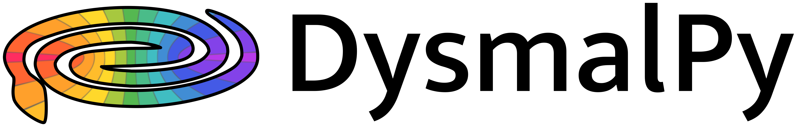

Dynamical Simulation and Modeling Algorithm
-------------------------------------------

.. image:: http://img.shields.io/badge/powered%20by-AstroPy-orange.svg?style=flat
    :target: http://www.astropy.org
    :alt: Powered by Astropy Badge

DYSMALPY website: https://www.mpe.mpg.de/resources/IR/DYSMALPY/

DysmalPy (DYnamical Simulation and Modelling ALgorithm in PYthon) is a 
Python-based forward modeling code designed for analyzing galaxy kinematics. 
It was originally inspired by Reinhard Genzel's DISDYN program 
(e.g., `Tacconi et al. 1994`_), has been developed and is maintained at 
the Max Planck Institute for Extraterrestrial Physics (MPE). 
It extends the IDL-based DYSMAL fitting models introduced and thoroughly 
tested in previous works (`Davies et al. 2004a`_; `Davies et al. 2004b`_; 
`Cresci et al. 2009`_; `Davies et al. 2011`_) as well as subsequent 
improvements described by `Wuyts et al. 2016`_; `Lang et al. 2017`_; `Genzel et al. 2017`_;
`Übler et al. 2018`_. Its Python incarnation and latest developments and 
testing are presented by `Price et al. 2021`_ and Lee et al. 2024, in prep. 

This code employs a set of models that describe the mass distribution and 
various kinematic components to describe and fit the kinematics of galaxies. 
Dysmalpy has several features, which include support for multiple halo profiles,
flexibility in modeling baryon components such as non-circular higher-order kinematic features,
multi-observation fitting, the ability to tie model component parameters together and 
options for fitting using either least-squares minimization (with `MPFIT`_),
Markov chain Monte Carlo (MCMC) posterior sampling (with `emcee`_) or dynamic nested sampling (with `Dynesty`_).

Dysmalpy is specifically designed for the analysis of disk galaxies.
The classification of a galaxy as a disk can be made following the set
of 5 criteria outlined by `Wisnioski et al. 2015`_; Sect. 4.1,
motivated by expectations for ideal rotating disks and increasingly
stringent and demanding of the data:

- Smooth monotonic velocity gradient across the galaxy, defining the kinematic axis;
- Centrally peaked velocity dispersion distribution with maximum at the position of steepest velocity gradient, defining the kinematic center;
- Dominant rotational support, quantified by the ratio of :math:`v_{rot}/\sigma_0>1`; 
- Coaligned morphological and kinematic major axes;
- Spatial coincidence of kinematic and morphological centers.
  
In practice, the first three criteria are essential.
Importantly, in the context of the disk framework, the velocity dispersion
:math:`\sigma_0` used for this classification denotes the random motions within the
disk component (corrected for spectral and spatial resolution), which relate
to its geometrical thickness.

Dysmalpy is parametric in nature, allowing the direct fitting of the intrinsic galaxy 
properties, exploration of mass decomposition, dark matter fractions, and 
assessment of parameter degeneracies and associated uncertainties. This stands 
in contrast to a non-parametric kinematic fitting approach, which requires 
additional steps for interpreting recovered intrinsic galaxy kinematic 
properties.

The forward modeling process involves simulating the mass distribution of a 
galaxy, generating a 3D mock cube capturing composite kinematics, and 
accounting for observational effects such as beam smearing and instrumental 
line broadening. The model cube can be directly compared to the datacube in 3D, 
but it can also be compared to 1D or 2D kinematic observations by extracting 
the corresponding one or two-dimensional profiles following the same procedure 
that was used on the observed data. For detailed information, refer to the 
Appendix in `Price et al. 2021`_ as well as Lee et al. 2024, in prep.

.. _MPFIT: https://code.google.com/archive/p/astrolibpy
.. _emcee: https://emcee.readthedocs.io
.. _Dynesty: https://dynesty.readthedocs.io
.. _installation instructions: https://github.com/dysmalpy/dysmalpy/blob/main/docs/installation.rst
.. _notebooks: https://github.com/dysmalpy/dysmalpy/tree/main/examples/notebooks
.. _tutorials: https://www.mpe.mpg.de/resources/IR/DYSMALPY/
.. _Tacconi et al. 1994: https://ui.adsabs.harvard.edu/abs/1994ApJ...426L..77T/abstract
.. _Davies et al. 2004a: https://ui.adsabs.harvard.edu/abs/2004ApJ...602..148D/abstract
.. _Davies et al. 2004b: https://ui.adsabs.harvard.edu/abs/2004ApJ...613..781D/abstract
.. _Cresci et al. 2009: https://ui.adsabs.harvard.edu/abs/2009ApJ...697..115C/abstract
.. _Davies et al. 2011: https://ui.adsabs.harvard.edu/abs/2011ApJ...741...69D/abstract
.. _Wuyts et al. 2016: https://ui.adsabs.harvard.edu/abs/2016ApJ...831..149W/abstract
.. _Lang et al. 2017: https://ui.adsabs.harvard.edu/abs/2017ApJ...840...92L/abstract
.. _Genzel et al. 2017: https://ui.adsabs.harvard.edu/abs/2017Natur.543..397G/abstract
.. _Übler et al. 2018: https://ui.adsabs.harvard.edu/abs/2018ApJ...854L..24U/abstract
.. _Price et al. 2021: https://ui.adsabs.harvard.edu/abs/2021ApJ...922..143P/abstract
.. _Wisnioski et al. 2015: https://ui.adsabs.harvard.edu/abs/2015ApJ...799..209W/abstract

Dependencies
------------
* python (version >= 3.10)
* numpy (version >= 1.24.3)
* scipy (version >=1.9.3)
* matplotlib
* pandas
* ipython
* defaults
* pytest
* multiprocess
* astropy (version >= 5.3)
* multiprocess
* emcee (version >= 3)
* dynesty (version >= 2.1.3)
* corner (version >= 2.2.2)
* cython
* dill (version >= 0.3.7)
* photutils (version >= 1.8.0)
* shapely (version >= 2)
* spectral-cube (version >= 0.6.0)
* radio-beam (version >= 0.3.3)
* h5py (version >= 3.8.0)
* six

Installation
------------

To install DYSMALPY, please follow the instructions in the `installation instructions`_ file.

Usage
-----

The overall basic usage of DYSMALPY can be summarized as follows:

**1) Setup steps:** Import modules, set paths, define global constants and 
variables.

**2) Initialize:** Create a galaxy object with its corresponding parameters, 
add the model set (disk, bulge, DM halo, etc), set up the observation and 
instrument information.

**3) Fitting:** Perform fitting/bayesian sampling in either 1D, 2D, or 3D using 
either MPFIT, MCMC or dynamic nested sampling.

**4) Assess:** Visualise, assess fit, and fine-tune the fitting. 

We strongly recommend following and understanding the `tutorials`_ section of the 
main website. Alternatively, you can run and familiarize yourself with the 
jupyter notebooks in the `notebooks`_ folder (these will be included in your 
installation of dysmalpy under examples/notebooks).

Contact
-------

If you have any questions or suggestions, please contact the developers at dysmalpy@mpe.mpg.de.

License
-------

This project is Copyright (c) MPE/IR-Submm Group. For the complete license and referencing information, please see 
the the `LICENSE`_ file.

.. _LICENSE: https://github.com/dysmalpy/dysmalpy/blob/main/LICENSE.rst

