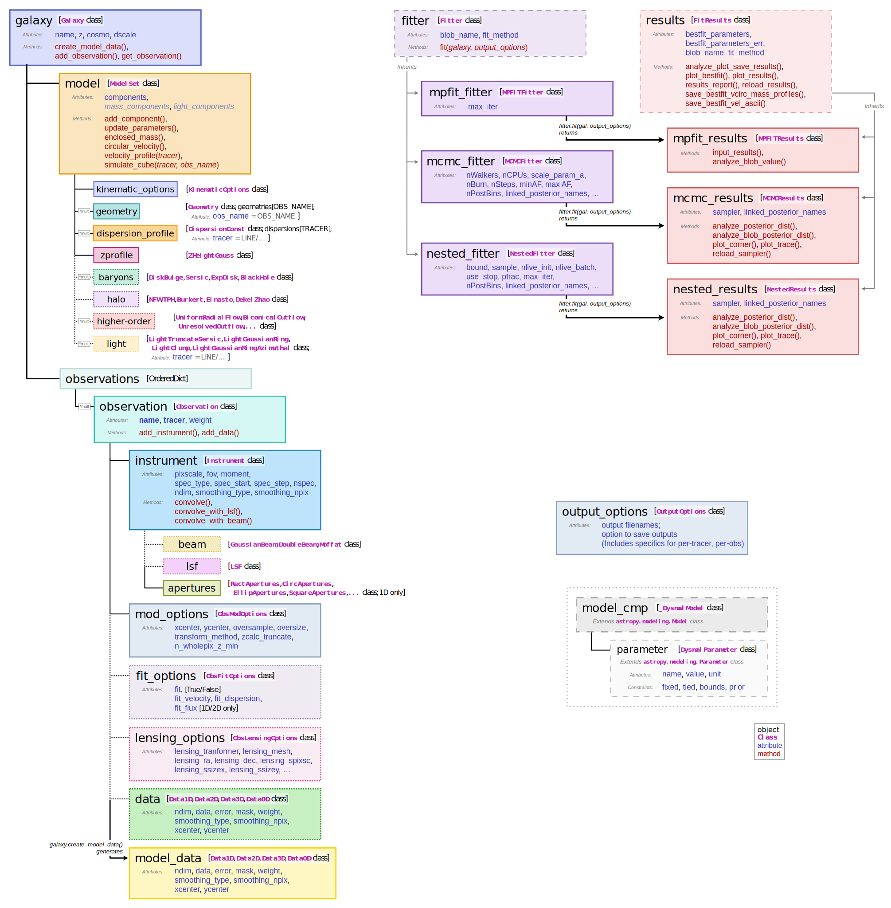

.. _overview_code_structure:
.. highlight:: shell

=======================
Code Structure Overview
=======================

Below is an overview schematic of the key classes and functionality of
DysmalPy.

Most DysmalPy functionality is built around using ``galaxy`` objects,
which are instances of the ``Galaxy`` class.
The key attributes of ``galaxy`` are ``data``, ``instrument``, and ``model``.

The ``data`` object contains information about the observed kinematic data,
and any specifics of how it was extracted
(e.g., aperture settings, gaussian or moment extraction). 
The ``instrument`` object contains ``beam`` and ``lsf``, encoding the
information to convolve an intrinsic model cube to match the observational data
(i.e., the PSF and LSF).
Finally, ``model`` itself contains a number of model objects in ``model.components``.
These components are taken together to generate the full intrinsic 3D model cube
using ``model.simulate_cube()``.

To generate a model matching the observed data, and including the instrumental effects,
``galaxy.create_model_data()`` is used (which begins by calling
``model.simulate_cube()`` before convolving with
the instrument and performing any extraction).

To perform fitting with DysmalPy, a ``galaxy`` object must be
constructed containing the appropriate observational data, instrumental settings,
and the model to be fit (including specifying which of the model parameters are
free or fixed, and their constraints).
The ``galaxy`` object is then passed as input to
``fitting.fit_mcmc(galaxy, **kwargs)`` or ``fitting.fit_mpfit(galaxy, **kwargs)``.
These fitting routines then return a ``results`` object,
which is an instance of the ``MCMCResults`` or ``MPFITResults`` class, as appropriate.

