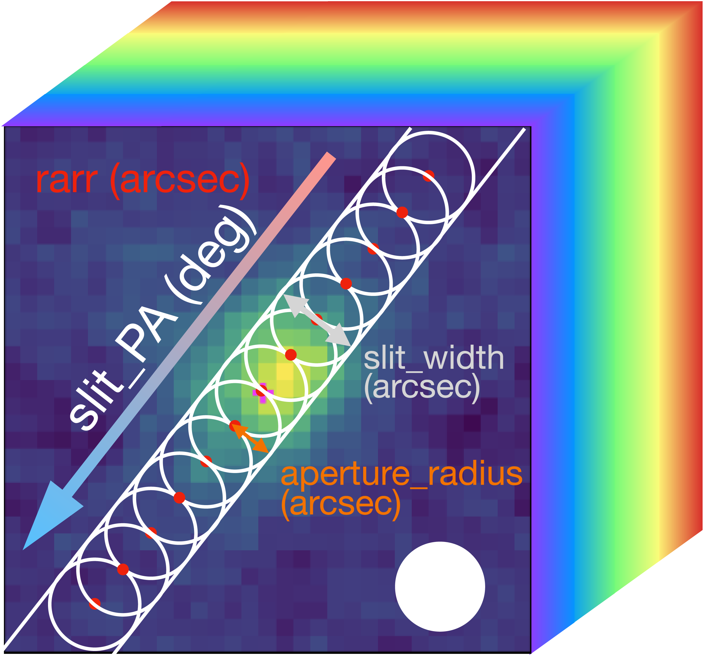
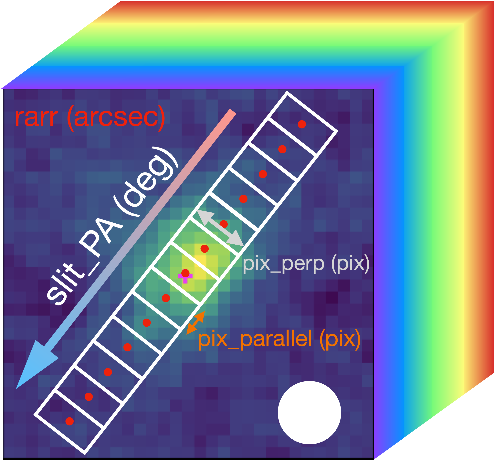

1D Aperture Setup
=================

Illustrations of the available 1D aperture setups using the :code:`aperture_classes` module.

Circular Aperture
-----------------
Keywords controlling the aperture shape: :code:`slit_pa`, :code:`slit_width`, :code:`aperture_radius`.

This setup consists of circular apertures with a radius specified by :code:`aperture_radius`. The apertures are positioned along the slit, which is defined by the parameters :code:`slit_pa` and :code:`slit_width`. The angle :code:`slit_pa` is the position angle in degrees from North pointing towards the blue side.
In general, :code:`slit_width` would be the FWHM of the beam size.
If :code:`aperture_radius` is not set, the user must provide a value for :code:`slit_width`.

The user has the flexibility to modify the aperture centers (the red dots) :code:`aper_center` by passing `rarr` (in unit of arcsecond) as an array.
Otherwise, the aperture centers will default to the values from :code:`obs.data.rarr` in :code:`setup_gal_models`. The default center pixel is the center of the data cube.

Rectangular Aperture
---------------------
Keywords controlling the aperture shape: :code:`slit_pa`, :code:`slit_width`, or alternatively, specify :code:`pix_perp` and :code:`pix_parallel`.

This setup consists of a series of rectangular apertures lies along the :code:`slit_pa`. The dimensions of the rectangles are controlled by either the parameters : :code:`slit_width` or by directly specifying :code:`pix_perp` and :code:`pix_parallel`.
These dimensions are illustrated below.

The user has the flexibility to define arrays for :code:`pix_perp` and :code:`pix_parallel`. They should match the length of the aperture centers specified in :code:`rarr` (in unit of arcsecond).
Otherwise, the aperture centers will default to the values from :code:`obs.data.rarr`.

Single Pixel PV
----------------
This configuration is equivalent to a Rectangular Aperture when :code:`pix_parallel` is set to 1.
